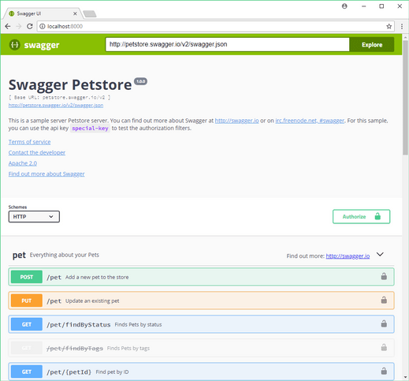

Swagger UI for Golang
===========


Brings Swagger UI to Go. This package implements an `http.Handler` which serves the Swagger UI. No assets needed, as the Swagger UI javascript and css assets are embedded.



## What's inside?

This includes three flavors:

#### ***`swaggerui.SwaggerHandler()`***
Which searches for, in this order, a `swagger.json`, `swagger.yml` or `swagger.yaml` file on the filesystem.
It searches the path of the caller function and the path of the executable, up to four parent folders.

#### ***`swaggerui.SwaggerFileHandler(path)`***
Handles a specified path to a swagger file (`json` or `yaml` format)

#### ***`swaggerui.SwaggerUrlHandler(url)`***
Handles a local or remote url to a swagger file.

## Examples

A simple `http` Swagger UI server:
```
http.ListenAndServe(":8080", swaggerui.SwaggerHandler())
```

The famous pet store:
```
http.ListenAndServe(":8080", swaggerui.SwaggerUrlHandler("http://petstore.swagger.io/v2/swagger.json"))
```

Using a file from the system:
```
// yaml
http.ListenAndServe(":8080", swaggerui.SwaggerFileHandler("./swagger.yaml"))
http.ListenAndServe(":8080", swaggerui.SwaggerFileHandler("./swagger.yml"))

// json
http.ListenAndServe(":8080", swaggerui.SwaggerFileHandler("./swagger.json"))
```

Path prefixed using `http`:
```
http.Handle("/swagger/", http.StripPrefix("/swagger/", swaggerui.SwaggerHandler()))
http.ListenAndServe(":8080", nil)
```

Using `gorilla/mux`:

```
router := mux.NewRouter()
router.PathPrefix("/swagger/").Handler(http.StripPrefix("/swagger/", swaggerui.SwaggerHandler()))

http.ListenAndServe(":8080", router)
```